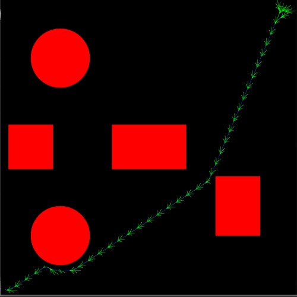

# A* Search Algorithm
A* is one of the more popular algorithms used in path search, and as such is extensively used in robot trajectory planning/object avoidance. This project is intended to simulate the working of the A* algorithm and we make use of ROS to visualize the same. First, let us go over the dependencies.

##  Installing Dependencies
This package was built using Python 3.7 and C++ 14 on Ubuntu Kernel 20.04. Follow the instructions on [this](https://wiki.ros.org/noetic/Installation/Ubuntu) page to install ROS (Noetic) and [this](https://docs.opencv.org/3.4/d2/de6/tutorial_py_setup_in_ubuntu.html) page to setup OpenCV for Ubuntu.

## Running the Package
First, source your ROS environment using
```
source /opt/ros/noetic/setup.bash
```
Now, create and build a `catkin workspace`:
```
mkdir -p ~/catkin_ws/src
cd ~/catkin_ws/
catkin_make
```
Download the `tbot` package into the `src` folder. Open the terminal and enter the following command:
```
cd src
git clone git@github.com:latent-pixel/A-Star-Algorithm.git
```
Rename the package, just to make it easy going ahead:
```
mv A-Star-Algorithm astar
```
Build the package and launch `turtlebot` in a `gazebo` environment:
```
catkin build astar
roslaunch astar turtlebot3_prjct3.launch
```
Open another terminal window and use following commands to start the path planner. You can visualize the output on the `gazebo` window.
```
cd ~/catkin_ws/src/astar/src
chmod +x Navigator.py
python3 Navigator.py
```

## Output
Upon running the package, you can visualize the A* algorithm in action,



*Figure: Path planner output.*


*Video: Gazebo Visualization* 

